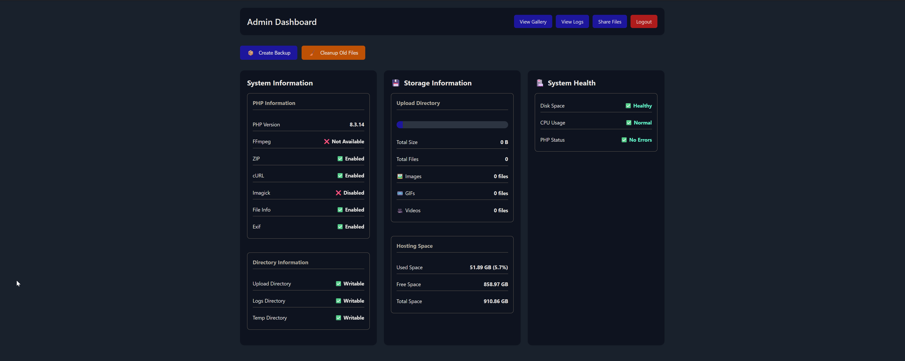
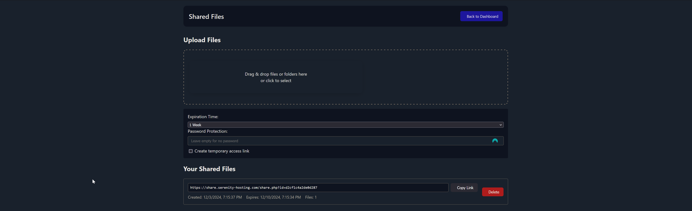
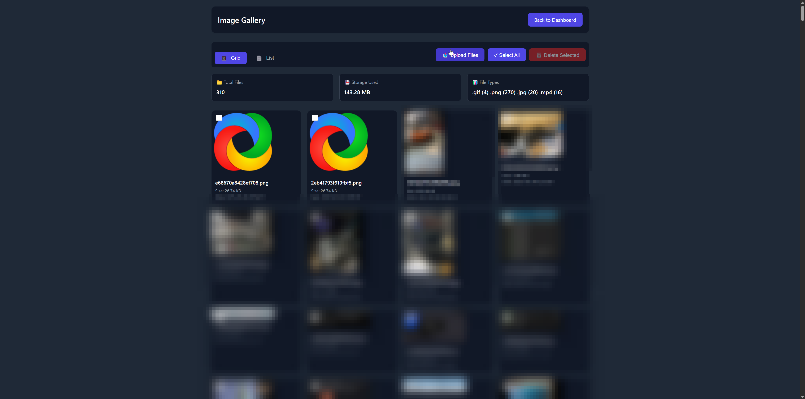
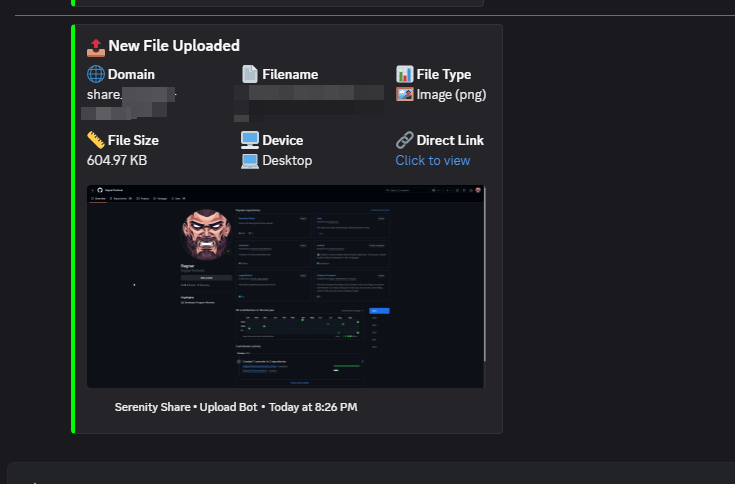

## Screenshots










# Serenity Share

**I'm not a pro developer, so I know the code is crap.**

This project was built with a focus on functionality rather than perfect code. It works, but the implementation might not follow best practices. Feel free to improve it!

Serenity Share is a free, open source, self-hosted file and image sharing solution with ShareX integration. Easy to deploy on any web host.

## Features

- 🖼️ Image Gallery - Browse and manage uploaded images through a beautiful gallery interface
- 📤 ShareX Integration - Ready to use with ShareX for quick screenshot and file uploads
- 🔒 Password Protection - Secure your uploads with optional password protection
- ⏱️ Expiring Links - Set expiration times for sensitive file sharing
- 📦 ZIP Downloads - Download multiple files as a ZIP archive
- 🚀 Easy Deployment - Simple installation process on any PHP-enabled web host
- 💬 Discord Notifications - Get real-time notifications in Discord when files are uploaded

## Requirements

- PHP 7.4 or higher

## Installation

1. Download or clone this repository to your web server
2. Configure your web server to serve the files
3. Edit `config.php` with your specific settings:
   - Update `domain_url` to point to your domain
   - Set a secure random string for `secret_key`
   - Change the admin password (default is "password") using yourdomain/hash_password.php
   - Add your IP to `admin_ips` for admin area access
4. Make sure upload directories are writable by your web server
5. Access your site and login to the admin area at `/admin.php`

## Discord Notifications Setup

Get notified in Discord whenever someone uploads a file to your server!

### Setup Steps:

1. **Create a Discord Webhook:**
   - Go to your Discord server
   - Right-click on the channel where you want notifications
   - Select "Edit Channel" → "Integrations" → "Webhooks"
   - Click "Create Webhook" and copy the webhook URL

2. **Configure in config.php:**
   ```php
   'discord_webhook_url' => 'https://discord.com/api/webhooks/YOUR_WEBHOOK_URL_HERE',
   'discord_notifications' => true // Set to true to enable notifications
   ```

3. **Features:**
   - 🎨 Rich embeds with file information
   - 🖼️ Image previews for uploaded images
   - 📊 File size, type, and device detection
   - 🎯 Color-coded by file type (green for images, red for videos)
   - 📱 Mobile/Desktop detection
   - ⏰ Timestamps
   - 🔗 Direct links to uploaded files

### To disable Discord notifications:
Set `'discord_notifications' => false` in config.php

## ShareX Configuration

1. Open the EDIT_BEFORE_LOADING.sxcu in any text editer and config to you
2. Import it into ShareX
3. Done

## Security Notes

- Change the default admin password immediately
- Set a strong, unique value for `secret_key` in config.php
- Keep your server and PHP version up to date
- Use HTTPS for all production deployments
- Restrict access to the admin area by IP

## License

This project is free and open source software. You are free to use, modify and distribute it under the terms of the MIT License.

## Credits

This project uses the following libraries:

- Font Awesome for icons
- SweetAlert2 for improved UI dialogs
- ParticlesJS for the background animation

## Contributing

Contributions are welcome! Feel free to submit issues or pull requests.
