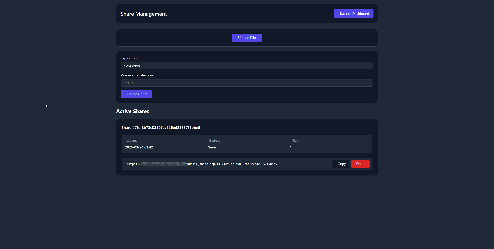

<div align="center">

# 🎨 Serenity Share

**A free, open-source, self-hosted file and image sharing solution with ShareX integration**

[](https://opensource.org/licenses/MIT)
[](https://www.php.net/)
[](https://github.com)

*Built with functionality in mind - easy to deploy on any web host*

[Features](#-features) • [Installation](#-installation) • [Configuration](#-configuration) • [Documentation](#-documentation) • [Contributing](#-contributing)

---

</div>

## 📋 Table of Contents

- [Overview](#-overview)
- [Features](#-features)
- [Screenshots](#-screenshots)
- [Requirements](#-requirements)
- [Quick Start](#-quick-start)
- [Installation](#-installation)
- [Configuration](#-configuration)
- [ShareX Integration](#-sharex-integration)
- [Discord Notifications](#-discord-notifications)
- [Security](#-security)
- [Troubleshooting](#-troubleshooting)
- [Documentation](#-documentation)
- [Contributing](#-contributing)
- [License](#-license)
- [Credits](#-credits)
- [Support](#-support)

---

## 🎯 Overview

**Serenity Share** is a powerful, self-hosted file and image sharing platform designed for individuals and teams who want complete control over their file sharing infrastructure. With seamless ShareX integration, beautiful gallery views, and advanced features like password protection and expiring links, Serenity Share provides a professional solution without the complexity.

> **⚠️ Note:** This project prioritizes functionality over perfect code architecture. While it works reliably, the implementation may not follow all best practices. Contributions and improvements are welcome!

### Why Serenity Share?

- 🚀 **Easy Deployment** - Get up and running in minutes on any PHP-enabled web host
- 🔒 **Privacy First** - Self-hosted means your files never leave your server
- 📁 **No Database Required** - Simple file-based storage, no database setup needed
- 🎨 **Beautiful UI** - Modern, responsive design with dark theme
- ⚡ **Fast & Lightweight** - Optimized for performance
- 🔧 **Highly Customizable** - Extensive configuration options
- 🌍 **Multi-language Support** - Available in 9 languages

---

## 🔧 How It Works

### File Upload Flow


### File Sharing Flow


---

## ✨ Features

### Core Features

| Feature | Description |
|---------|-------------|
| 🖼️ **Image Gallery** | Browse and manage uploaded images through a beautiful, responsive gallery interface |
| 📤 **ShareX Integration** | Ready-to-use configuration for ShareX with quick screenshot and file uploads |
| 🔒 **Password Protection** | Secure your uploads with optional password protection |
| ⏱️ **Expiring Links** | Set expiration times for sensitive file sharing |
| 📦 **ZIP Downloads** | Download multiple files as a ZIP archive |
| 🎨 **QR Code Generation** | Generate QR codes for easy file sharing |
| 📊 **Admin Dashboard** | Comprehensive admin panel for file management |
| 📝 **Access Logs** | Track file access and view statistics |
| 🌍 **Multi-language** | Support for 9 languages (EN, DE, ES, FR, IT, JA, KO, PT, RU, ZH) |

### Advanced Features

- 💬 **Discord Notifications** - Real-time notifications in Discord when files are uploaded
- 🔗 **URL Shortening** - Built-in URL shortening functionality
- 🖼️ **Image Thumbnails** - Automatic thumbnail generation for images
- 📱 **Mobile Responsive** - Works seamlessly on all devices
- 🎯 **Device Detection** - Automatically detect and log device information
- 🔄 **Backup System** - Automated backup functionality
- ⚡ **Caching System** - Performance optimization through caching

---

## 📸 Screenshots

<div align="center">

### Dashboard


### File Sharing Interface


### Gallery View


### Discord Notifications


</div>

---

## 📦 Requirements

### Server Requirements

- **PHP** 8.1 or higher (required for QR code generation)
- **Web Server** (Apache/Nginx)
- **PHP Extensions:**
  - `GD` extension (for image manipulation and QR codes)
  - `mbstring` extension (for string handling)
  - `json` extension (for JSON operations)
- **Composer** (for installing QR code dependencies)

> **Note:** This project uses **file-based storage** (no database required). All data is stored in directories and JSON files.

### Recommended Specifications

- **RAM:** Minimum 1GB (2GB recommended)
- **Storage:** Depends on your file upload needs
- **Control Panel:** DirectAdmin compatible (recommended)

### Browser Support

- Chrome/Edge (latest)
- Firefox (latest)
- Safari (latest)
- Opera (latest)

---

## 🚀 Quick Start

Get Serenity Share up and running in 5 minutes:

```bash
# 1. Clone the repository
git clone https://github.com/ragnarthegreat/Serenity-Share.git
cd Serenity-Share

# 2. Install Composer dependencies
composer install

# 3. Configure your settings
# Edit config.php with your domain and settings

# 4. Generate admin password hash
# Visit: yourdomain.com/hash_password.php

# 5. Update config.php with the generated hash

# 6. Access admin panel
# Visit: yourdomain.com/admin.php
```

> **⚠️ Important:** The `vendor` folder must be included when downloading/uploading files. If QR codes don't work, visit `check_qr_setup.php` to diagnose the issue.

---

## 📥 Installation

### Step 1: Download Files

**Option A: Using Git**
```bash
git clone https://github.com/RagnarTheGreat/Serenity-Share.git
cd Serenity-Share
```

**Option B: Manual Download**
- Download ALL files from GitHub (including the `vendor` folder - this is required for QR codes!)
- Extract the archive to your desired location

### Step 2: Install Dependencies

Install Composer dependencies (required for QR code feature):

```bash
composer install
```

> **Note:** If you don't have Composer installed, download it from [getcomposer.org](https://getcomposer.org/download/)

### Step 3: Upload to Server

Upload all files to your web server. You can use:
- FTP/SFTP client (FileZilla, WinSCP, etc.)
- cPanel File Manager
- DirectAdmin File Manager
- SSH/SCP

**Important:** Ensure the `vendor` folder is included in the upload!

### Step 4: Configure Web Server

#### Apache Configuration

Ensure `.htaccess` is enabled and mod_rewrite is active:

```apache
# .htaccess should already be included
# Make sure mod_rewrite is enabled
```

#### Nginx Configuration

Add the following to your Nginx server block:

```nginx
location / {
    try_files $uri $uri/ /index.php?$query_string;
}

location ~ \.php$ {
    fastcgi_pass unix:/var/run/php/php8.1-fpm.sock;
    fastcgi_index index.php;
    include fastcgi_params;
    fastcgi_param SCRIPT_FILENAME $document_root$fastcgi_script_name;
}
```

### Step 5: Set Permissions

Make sure upload directories are writable:

```bash
chmod -R 755 uploads/
chmod -R 755 thumbnails/
chmod -R 755 cache/
chmod -R 755 logs/
chmod -R 755 img/
chmod -R 755 shares/
chmod -R 755 links/
```

> **Note:** No database setup required! Serenity Share uses file-based storage. All files and metadata are stored in directories and JSON files.

---

## ⚙️ Configuration

### Basic Configuration

Edit `config.php` with your specific settings:

```php
<?php
return [
    // Domain Configuration
    'domain_url' => 'https://yourdomain.com',
    
    // Security
    'secret_key' => 'your-secure-random-string-here', // Generate a strong random string
    'admin_password' => 'your-hashed-password', // Use hash_password.php to generate
    
    // Admin Access
    'admin_ips' => ['127.0.0.1', 'your.ip.address'], // Restrict admin access by IP
    
    // File Upload Settings
    'max_file_size' => 100 * 1024 * 1024, // 100MB
    'allowed_extensions' => ['jpg', 'jpeg', 'png', 'gif', 'pdf', 'zip'],
    
    // Discord Notifications
    'discord_webhook_url' => 'https://discord.com/api/webhooks/YOUR_WEBHOOK_URL',
    'discord_notifications' => true,
];
```

### Generate Admin Password Hash

1. Visit `yourdomain.com/hash_password.php`
2. Enter your desired password
3. Copy the generated hash
4. Update `admin_password` in `config.php`

### Security Configuration

**Important Security Settings:**

```php
// Generate a strong secret key (32+ characters)
'secret_key' => bin2hex(random_bytes(32)),

// Restrict admin access by IP
'admin_ips' => ['your.ip.address.here'],

// Enable HTTPS only
'force_https' => true,
```

---

## 📤 ShareX Integration

### Setup Instructions

1. **Edit Configuration File:**
   - Open `EDIT_BEFORE_LOADING.sxcu` in any text editor
   - Replace `YOUR_DOMAIN` with your actual domain
   - Update any other settings as needed

2. **Import into ShareX:**
   - Open ShareX
   - Go to **Destinations** → **Custom uploader settings**
   - Click **Import** and select `EDIT_BEFORE_LOADING.sxcu`
   - Configure as your default uploader

3. **Test Upload:**
   - Take a screenshot or upload a file
   - Verify it appears in your gallery

### ShareX Configuration File Structure

```json
{
  "Version": "14.1.0",
  "Name": "Serenity Share",
  "DestinationType": "ImageUploader, FileUploader",
  "RequestMethod": "POST",
  "RequestURL": "https://yourdomain.com/upload.php",
  "Body": "MultipartFormData",
  "FileFormName": "file",
  "URL": "$json:url$",
  "ThumbnailURL": "$json:thumbnail$"
}
```

---

## 💬 Discord Notifications

Get real-time notifications in Discord whenever someone uploads a file to your server!

### Setup Steps

#### 1. Create a Discord Webhook

1. Go to your Discord server
2. Right-click on the channel where you want notifications
3. Select **Edit Channel** → **Integrations** → **Webhooks**
4. Click **Create Webhook**
5. Copy the webhook URL

#### 2. Configure in config.php

```php
'discord_webhook_url' => 'https://discord.com/api/webhooks/YOUR_WEBHOOK_URL_HERE',
'discord_notifications' => true, // Set to true to enable notifications
```

#### 3. Features

- 🎨 **Rich Embeds** - Beautiful embeds with file information
- 🖼️ **Image Previews** - Automatic image previews for uploaded images
- 📊 **File Details** - File size, type, and device detection
- 🎯 **Color Coding** - Color-coded by file type (green for images, red for videos)
- 📱 **Device Detection** - Mobile/Desktop detection
- ⏰ **Timestamps** - Automatic timestamping
- 🔗 **Direct Links** - Direct links to uploaded files

#### 4. Disable Notifications

To disable Discord notifications, set:

```php
'discord_notifications' => false
```

For more detailed setup instructions, see [Discord Webhook Setup Guide](docs/discord-webhook-setup.md).

---

## 🔒 Security

### Security Best Practices

1. **Change Default Password**
   - Immediately change the default admin password
   - Use `hash_password.php` to generate a secure hash

2. **Secure Secret Key**
   - Generate a strong, unique value for `secret_key` in config.php
   - Use at least 32 random characters

3. **IP Restriction**
   - Restrict access to the admin area by IP address
   - Add your IP to `admin_ips` in config.php

4. **HTTPS Only**
   - Always use HTTPS for production deployments
   - Configure SSL/TLS certificates properly

5. **Keep Updated**
   - Keep your server and PHP version up to date
   - Regularly update dependencies via Composer

6. **File Permissions**
   - Set appropriate file permissions (755 for directories, 644 for files)
   - Don't expose sensitive files publicly
   - Ensure upload directories are writable but not executable

### Security Checklist

- [ ] Changed default admin password
- [ ] Generated secure `secret_key`
- [ ] Configured IP restrictions for admin area
- [ ] Enabled HTTPS
- [ ] Set proper file permissions
- [ ] Updated PHP to latest version
- [ ] Enabled firewall rules
- [ ] Regular backups configured

---

## 🔧 Troubleshooting

### Common Issues

#### QR Codes Not Working

**Problem:** QR codes are not generating or displaying.

**Solutions:**
1. Ensure `vendor` folder is uploaded to your server
2. Run `composer install` to install dependencies
3. Verify PHP 8.1+ is installed
4. Check that GD extension is enabled:
   ```bash
   php -m | grep -i gd
   ```
5. Visit `check_qr_setup.php` to diagnose the issue
6. Check file permissions on cache directory

#### Upload Fails

**Problem:** Files are not uploading.

**Solutions:**
1. Check PHP `upload_max_filesize` and `post_max_size` in `php.ini`
2. Verify directory permissions (uploads folder must be writable)
3. Check disk space on server
4. Review error logs in `logs/` directory
5. Verify file extensions are allowed in `config.php`

#### Admin Panel Not Accessible

**Problem:** Cannot access admin panel.

**Solutions:**
1. Verify your IP is in `admin_ips` array in `config.php`
2. Check admin password is correctly hashed
3. Clear browser cache and cookies
4. Check server error logs
5. Verify `.htaccess` is working correctly
6. Ensure `ip_whitelist_enabled` is set to `false` if you want to disable IP restrictions

#### File Storage Issues

**Problem:** Files not saving or metadata not persisting.

**Solutions:**
1. Check directory permissions (directories must be writable)
2. Verify disk space is available
3. Check that `img/`, `shares/`, and `links/` directories exist
4. Review error logs in `logs/` directory
5. Ensure PHP has write permissions to these directories

#### Discord Notifications Not Working

**Problem:** Discord webhook not sending notifications.

**Solutions:**
1. Verify webhook URL is correct in `config.php`
2. Check `discord_notifications` is set to `true`
3. Test webhook manually using `test_webhook.php`
4. Check Discord server logs
5. Verify webhook hasn't been deleted or expired

### Getting Help

If you're still experiencing issues:

1. Check the [Issues](https://github.com/ragnarthegreat/Serenity-Share/issues) page
2. Review server error logs
3. Join our [Discord Server](https://discord.gg/9t2pKpwn2g) for support
4. Create a new issue with:
   - PHP version
   - Server configuration
   - Error messages
   - Steps to reproduce

---

## 📚 Documentation

Additional documentation is available in the `docs/` directory:

- [Discord Webhook Setup](docs/discord-webhook-setup.md)
- [Password Hash Guide](docs/password-hash-guide.md)
- [Installation Guide](INSTALL.md)

### API Documentation

For developers looking to integrate with Serenity Share:

- **Upload Endpoint:** `POST /upload.php`
- **Gallery API:** `GET /gallery.php`
- **Admin API:** `GET /admin.php`

---

## 🤝 Contributing

Contributions are welcome and greatly appreciated! Here's how you can help:

### Ways to Contribute

- 🐛 **Report Bugs** - Found a bug? Open an issue!
- 💡 **Suggest Features** - Have an idea? Share it with us!
- 📝 **Improve Documentation** - Help make the docs better
- 🔧 **Submit Pull Requests** - Fix bugs or add features
- 🌍 **Translate** - Help translate to more languages
- ⭐ **Star the Project** - Show your support!

### Contribution Guidelines

1. **Fork the Repository**
   ```bash
   git clone https://github.com/ragnarthegreat/Serenity-Share.git
   cd Serenity-Share
   ```

2. **Create a Feature Branch**
   ```bash
   git checkout -b feature/amazing-feature
   ```

3. **Make Your Changes**
   - Follow existing code style
   - Add comments for complex logic
   - Test your changes thoroughly

4. **Commit Your Changes**
   ```bash
   git commit -m "Add amazing feature"
   ```

5. **Push to Your Fork**
   ```bash
   git push origin feature/amazing-feature
   ```

6. **Open a Pull Request**
   - Provide a clear description
   - Reference any related issues
   - Include screenshots if applicable

### Code Style

- Follow PSR-12 coding standards
- Use meaningful variable names
- Add comments for complex functions
- Keep functions focused and small

---

## 📄 License

This project is licensed under the **MIT License** - see the [LICENSE](LICENSE) file for details.

```
MIT License

Copyright (c) 2024 Serenity Share

Permission is hereby granted, free of charge, to any person obtaining a copy
of this software and associated documentation files (the "Software"), to deal
in the Software without restriction, including without limitation the rights
to use, copy, modify, merge, publish, distribute, sublicense, and/or sell
copies of the Software, and to permit persons to whom the Software is
furnished to do so, subject to the following conditions:

The above copyright notice and this permission notice shall be included in all
copies or substantial portions of the Software.

THE SOFTWARE IS PROVIDED "AS IS", WITHOUT WARRANTY OF ANY KIND, EXPRESS OR
IMPLIED, INCLUDING BUT NOT LIMITED TO THE WARRANTIES OF MERCHANTABILITY,
FITNESS FOR A PARTICULAR PURPOSE AND NONINFRINGEMENT. IN NO EVENT SHALL THE
AUTHORS OR COPYRIGHT HOLDERS BE LIABLE FOR ANY CLAIM, DAMAGES OR OTHER
LIABILITY, WHETHER IN AN ACTION OF CONTRACT, TORT OR OTHERWISE, ARISING FROM,
OUT OF OR IN CONNECTION WITH THE SOFTWARE OR THE USE OR OTHER DEALINGS IN THE
SOFTWARE.
```

---

## 🙏 Credits

### Libraries & Frameworks

This project uses the following open-source libraries:

- **[Font Awesome](https://fontawesome.com/)** - Icon library
- **[SweetAlert2](https://sweetalert2.github.io/)** - Beautiful, responsive, customizable popup dialogs
- **[Particles.js](https://vincentgarreau.com/particles.js/)** - Lightweight JavaScript library for creating particles
- **[Endroid QR Code](https://github.com/endroid/qr-code)** - QR code generation library

### Special Thanks

- All contributors who have helped improve this project
- The open-source community for inspiration and support

---

## 💬 Support

### Get Help

- 📖 **Documentation** - Check the docs in the `docs/` folder
- 🐛 **Issues** - Report bugs on [GitHub Issues](https://github.com/ragnarthegreat/Serenity-Share/issues)
- 💬 **Discord** - Join our [Discord Server](https://discord.gg/9t2pKpwn2g) for support and discussions
- 📧 **Email** - Contact us for enterprise support

### Community

- ⭐ **Star us on GitHub** - Show your support!
- 🍴 **Fork the repository** - Make your own version
- 📢 **Share with others** - Help spread the word!

---

<div align="center">

**Made with ❤️ by the Serenity Share community**

[⬆ Back to Top](#-serenity-share)

</div>
